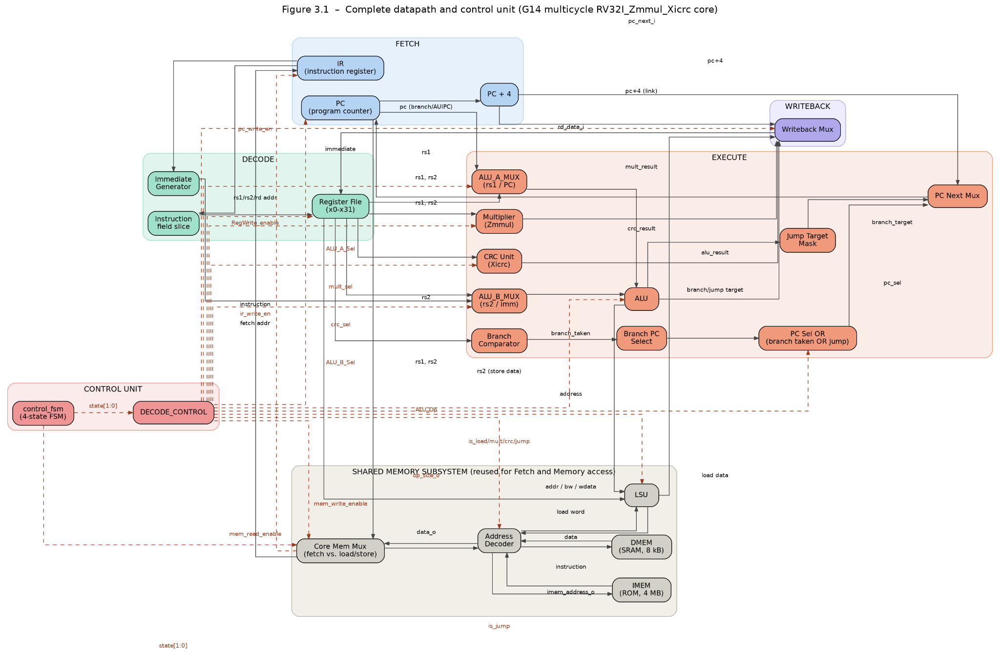
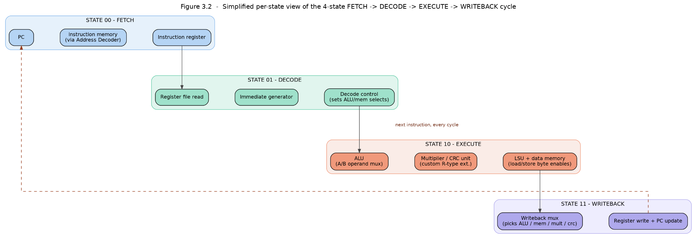
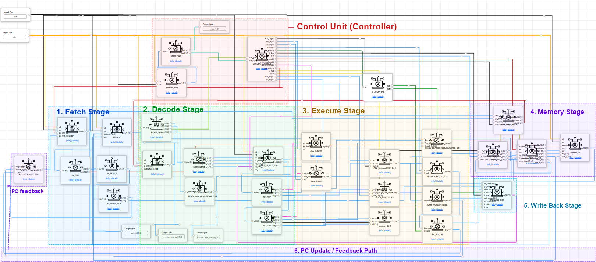
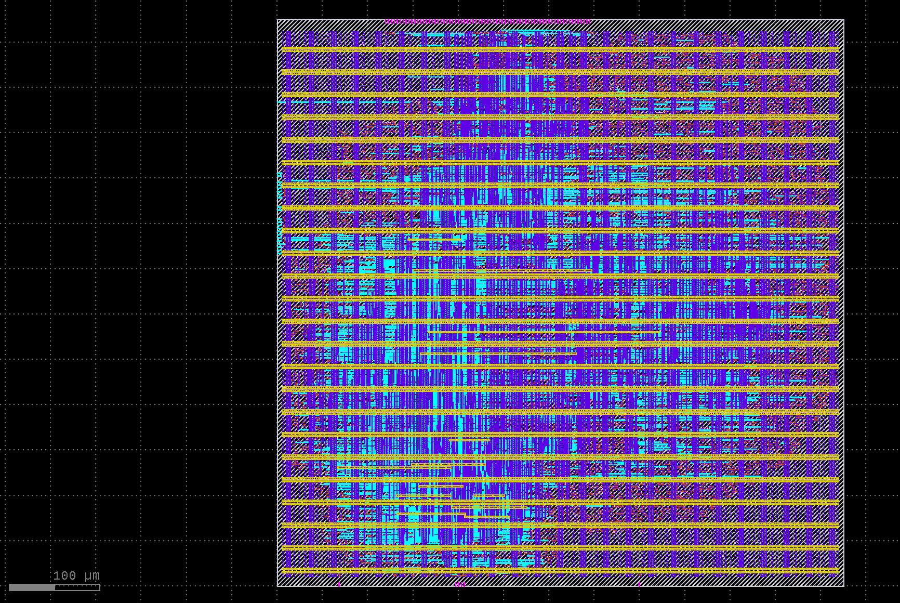
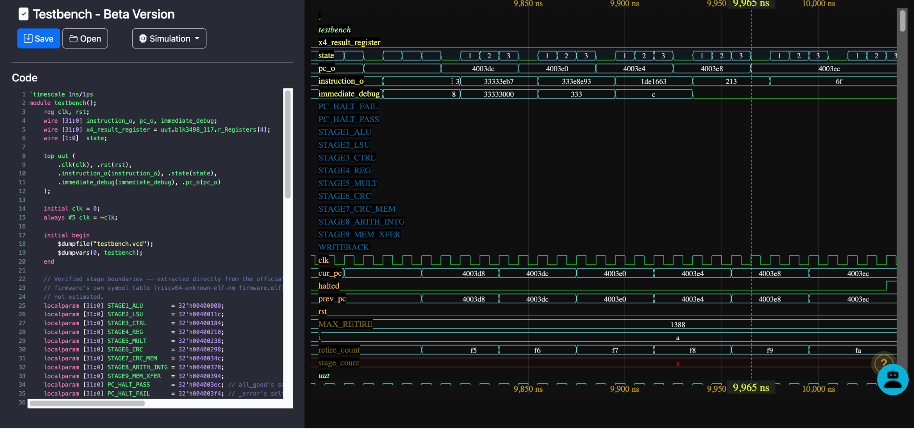
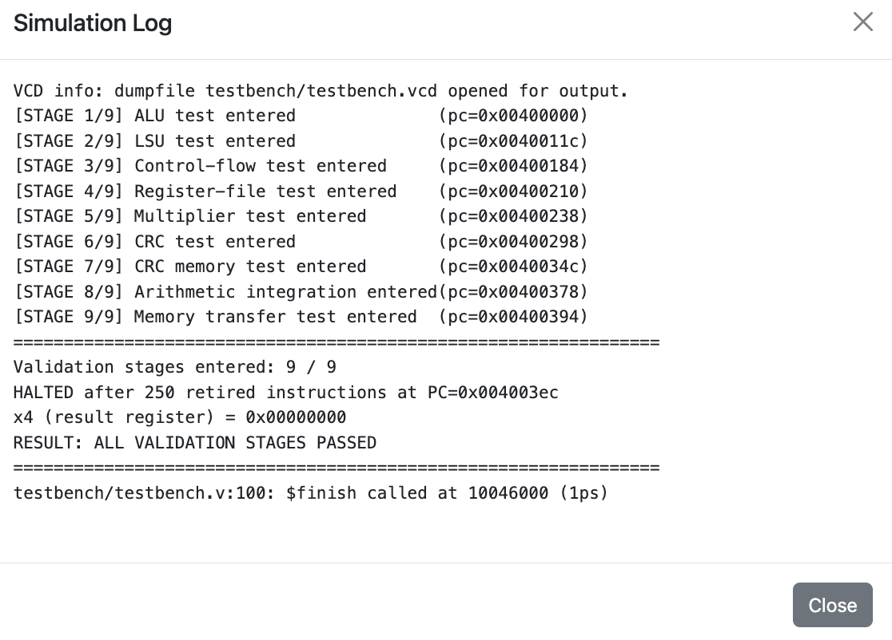

# G14 — Multicycle RV32I_Zmmul_Xicrc RISC-V Processor

**ChampionCHIP eXperience (Malaysia Edition) — Stage 2 Design Submission**
**Team Equipe 14**


-blue)


A 32-bit, 4-state multicycle RISC-V core implementing the **RV32I** base ISA, the **Zmmul** multiplication extension, and a custom **Xicrc** CRC-16 extension — designed in ChipInventor, verified with a self-checking testbench suite, and carried through a full OpenLane physical implementation flow on Sky130A.

▶ **Video walkthrough:** https://youtu.be/ja_pg3AdSc0?si=6IZYrneSH67sOOdd

---

## Table of Contents

- [Overview](#overview)
- [Team](#team)
- [Results at a Glance](#results-at-a-glance)
- [Repository Structure](#repository-structure)
- [Architecture](#architecture)
- [Instruction Set Coverage](#instruction-set-coverage)
- [Instruction Encoding](#instruction-encoding)
- [Module Verification Summary](#module-verification-summary)
- [Physical Implementation (OpenLane)](#physical-implementation-openlane)
- [Firmware Validation](#firmware-validation)
- [Getting Started](#getting-started)
- [Submission Checklist](#submission-checklist)
- [Repository Notes](#repository-notes)

---

## Overview

The G14 project implements a 32-bit multicycle RISC-V processor supporting the RV32I base instruction set, the Zmmul multiplication extension, and a custom Xicrc CRC extension, targeting the ChampionCHIP Phase 2 design challenge. The processor extends the single-cycle reference core provided in ChampionCHIP training into a **4-state finite-state-machine architecture** — `FETCH → DECODE → EXECUTE → WRITEBACK` — allowing hardware blocks such as the ALU and the shared instruction/data memory bus to be time-shared across the instruction cycle rather than duplicated, consistent with the resource-sharing philosophy of the reference ChipInventor RVBL-2 core.

The design comprises eleven primary modules (Section 4 of the report): a 3-level hierarchical dual-read-port Register File, an Immediate Generator supporting all five RISC-V immediate formats, a Branch Comparator, a combinational ALU performing eleven operations, a Multiplier implementing all four Zmmul variants, a CRC unit implementing the Xicrc extension against the organizer-confirmed CRC-16-CCITT-FALSE algorithm, an Address Decoder routing shared-bus traffic between instruction and data memory, a Load/Store Unit handling all five load and three store variants, and the Control Unit/FSM pair driving the datapath. Every module is verified by its own self-checking testbench.

The processor implements **44 of 44** instructions required for this stage (100% coverage — System/Synchronization instructions were confirmed out of scope by the organizers), verified end-to-end by successfully executing the official Stage 2 validation firmware to completion: all 9 validation stages passed, halting at the correct address with the expected result register value. The design was additionally carried through a complete OpenLane physical implementation flow on the Sky130A PDK, achieving clean signoff with zero DRC violations, zero LVS errors, and full setup/hold timing closure at a 625×625 µm die.

## Team

| Name | University |
|---|---|
| Hwong Jin Kang (Leader) | UM |
| Tan Ying Ru | UTHM |
| Tng Kah Hong | APU |
| Tan Kai Jian | UPM |
| Amirul Hakim Bin Abdunnajib | University of Manchester |

## Results at a Glance

| Metric | Result |
|---|---|
| ISA coverage | **44 / 44 instructions (100%)** — RV32I + Zmmul + Xicrc |
| Firmware validation | **9 / 9 stages passed** — halted after 250 retired instructions at `PC=0x004003ec`, `x4=0x00000000` |
| DRC violations | **0** |
| LVS errors | **0** |
| Timing closure | Setup **and** hold met at the 20 ns (50 MHz) target clock period |
| Die area | 0.390625 mm² (625 × 625 µm), 0.369 mm² usable core area |
| Core utilization | 41.98% (density 40110.08 cells/mm²) |
| PDK | Sky130A, 130 nm |
| Module-level assertions | Register File 11/11 · Address Decoder 15/15 · Multiplier 7/7 · ALU 16/16 · Control Unit/FSM 32/32 (see [module table](#module-verification-summary)) |

## Repository Structure

```
G14-RV32I-Zmmul-Xicrc-CPU/
├── README.md
├── .gitignore
├── .gitattributes
├── docs/
│   ├── G14_Stage2_Design_Submission_Report.pdf      # Full team report (source of this README)
│   ├── ChampionCHIP_Stage2_Design_Submission_Guide.pdf  # Official organizer guide
│   └── figures/                                     # Diagrams pulled from the report, for inline use below
│       ├── 01_datapath_and_control_unit.png
│       ├── 02_fsm_per_state_view.png
│       ├── 03_module_architecture.png
│       ├── 04_gdsii_layout.png
│       ├── 05_waveform_halt_detection.png
│       └── 06_testbench_log_output.png
├── rtl/
│   ├── top_rtl.v                # Full integrated core — used for functional/firmware simulation (8 kB DMEM, 4 MB IMEM)
│   └── top_openlane_mock.v      # Reduced IMEM/DMEM (4 words / 16 bytes) variant used for the OpenLane synthesis pass
├── tb/
│   ├── integration/             # Instruction-category and full-firmware testbenches (instantiate the top-level `top` module)
│   │   ├── Validation_Firmware_Testbench.v
│   │   ├── Testbench_SHOW_ALL_STAGES_PASS.v
│   │   ├── testbench_All_instructions_category.v
│   │   ├── testbench_5_rtype.v
│   │   ├── testbench_3_immediate.v
│   │   ├── testbench_load_type_instructions.v
│   │   ├── testbench_BRANCH_TYPE.v
│   │   ├── testbench_JUMP_TYPE.v
│   │   ├── testbench_before_MEM.v
│   │   ├── testbench_HOLISTIC_2.v
│   │   ├── testbench_TEST_HOLISTIC.v
│   │   ├── TESTBENCH_21_instructions.v
│   │   └── 35_instructions_testbench.v
│   └── unit/                    # Per-module self-checking testbenches (built against ChipInventor's standalone per-module exports)
│       ├── tb_alu.v
│       ├── tb_register_file.v
│       ├── tb_immediate_generator.v
│       ├── tb_branch_comparator.v
│       ├── tb_multiplier.v
│       ├── tb_crc_unit.v
│       ├── tb_lsu.v
│       ├── tb_address_decoder.v
│       ├── tb_imem.v
│       ├── tb_dmem.v
│       ├── tb_cpu_validation.v
│       └── tb_fetch_pc_legacy.v
└── synthesis/
    ├── config.json               # OpenLane run configuration (DESIGN_NAME=top, 20 ns clock, 625×625 µm die)
    ├── gl/
    │   ├── top.v                 # Powered gate-level netlist (results/final/verilog/gl equivalent)
    │   └── top.nl.v              # Unpowered gate-level netlist
    └── gds/
        └── top.gds               # Final GDSII (~47.6 MiB — see Repository Notes on Git LFS)
```

This layout satisfies every item on the organizer's **Expected Files** list (report, GDSII, gate-level netlist, `config.json`, all RTL/testbench code, video URL) while keeping each artifact type in its own top-level folder — see the [Submission Checklist](#submission-checklist) for the exact mapping.

## Architecture

The core cycles unconditionally through four states — `FETCH → DECODE → EXECUTE → WRITEBACK` — with a single shared ALU, shared address bus, and shared Address Decoder reused across fetch and load/store traffic. Figure 1 is the complete wiring diagram (data flow solid, control flow dashed); Figure 2 regroups the same blocks by which FSM state activates them.

**Figure 1 — Complete datapath and control unit**


**Figure 2 — Simplified per-state view of the FETCH → DECODE → EXECUTE → WRITEBACK cycle**


**Figure 3 — Full module-level architecture, as implemented in ChipInventor**


Key design points:

- **FETCH:** PC drives the shared bus through `CORE_MEM_MUX` and `address_decoder_G14` into IMEM; the returned word latches into `IR` only while `ir_write_en` is asserted (FETCH state only).
- **DECODE:** `INSTR_SLICE` extracts `rs1`/`rs2`/`rd`/`funct3`; the Register File returns operands combinationally (asynchronous read); the Immediate Generator produces the correctly extended I/S/B/U/J immediate; `DECODE_CONTROL` computes every control signal for the rest of the cycle up front.
- **EXECUTE:** `ALU_A_MUX`/`ALU_B_MUX` select operands (PC vs. `rs1`, immediate vs. `rs2`); one ALU result is reused as the arithmetic/logic result, the effective load/store address, **or** the branch/jump target. The Multiplier and CRC unit run in parallel off the same operands, gated by `is_mult`/`is_crc`. The LSU converts the ALU-computed address into byte-write masks and positioned data.
- **WRITEBACK:** The Writeback Mux selects among ALU result, loaded data, multiplier result, CRC result, or `PC+4` (JAL/JALR link); `RegWrite_enable` and `pc_write_en` are asserted **only** in this state, which is what keeps every side effect (register commit, memory write, PC update) confined to a single point per instruction.

## Instruction Set Coverage

| Category | Expected | Implemented | Coverage |
|---|---:|---:|---:|
| Arithmetic and Logic (Register) | 10 | 10 | 100% |
| Arithmetic and Logic (Immediate) | 9 | 9 | 100% |
| Load | 5 | 5 | 100% |
| Store | 3 | 3 | 100% |
| Branch | 6 | 6 | 100% |
| Jump | 2 | 2 | 100% |
| Upper Immediate | 2 | 2 | 100% |
| Multiplication (Zmmul) | 4 | 4 | 100% |
| CRC (Xicrc) | 3 | 3 | 100% |
| **Total** | **44** | **44** | **100%** |

> **Note on scope:** the original Stage 2 guide's baseline table lists 47 instructions, including 3 System/Synchronization instructions. Per the organizers' later clarification, System/Synchronization instructions were excluded from the graded scope for this stage — the 44-instruction total above reflects that clarification.

By category:

- **Arithmetic and Logic (Register) (10/10):** `ADD SUB SLL SLT SLTU XOR SRL SRA OR AND`
- **Arithmetic and Logic (Immediate) (9/9):** `ADDI SLTI SLTIU XORI ORI ANDI SLLI SRLI SRAI`
- **Load (5/5):** `LB LH LW LBU LHU`
- **Store (3/3):** `SB SH SW`
- **Branch (6/6):** `BEQ BNE BLT BGE BLTU BGEU`
- **Jump (2/2):** `JAL JALR`
- **Upper Immediate (2/2):** `LUI AUIPC`
- **Multiplication (4/4):** `MUL MULH MULHSU MULHU`
- **CRC (3/3):** `CRCB CRCH CRCW`

## Instruction Encoding

Opcode / funct3 / funct7 as encoded in the RTL (Control Unit, ALU, Branch Comparator, LSU). `—` = field not used by that instruction's format.

| Instruction | Opcode | Funct3 | Funct7 |
|---|---|---|---|
| ADD | 0110011 | 000 | 0000000 |
| SUB | 0110011 | 000 | 0100000 |
| SLL | 0110011 | 001 | 0000000 |
| SLT | 0110011 | 010 | 0000000 |
| SLTU | 0110011 | 011 | 0000000 |
| XOR | 0110011 | 100 | 0000000 |
| SRL | 0110011 | 101 | 0000000 |
| SRA | 0110011 | 101 | 0100000 |
| OR | 0110011 | 110 | 0000000 |
| AND | 0110011 | 111 | 0000000 |
| ADDI | 0010011 | 000 | — |
| SLTI | 0010011 | 010 | — |
| SLTIU | 0010011 | 011 | — |
| XORI | 0010011 | 100 | — |
| ORI | 0010011 | 110 | — |
| ANDI | 0010011 | 111 | — |
| SLLI | 0010011 | 001 | 0000000 |
| SRLI | 0010011 | 101 | 0000000 |
| SRAI | 0010011 | 101 | 0100000 |
| LB | 0000011 | 000 | — |
| LH | 0000011 | 001 | — |
| LW | 0000011 | 010 | — |
| LBU | 0000011 | 100 | — |
| LHU | 0000011 | 101 | — |
| SB | 0100011 | 000 | — |
| SH | 0100011 | 001 | — |
| SW | 0100011 | 010 | — |
| BEQ | 1100011 | 000 | — |
| BNE | 1100011 | 001 | — |
| BLT | 1100011 | 100 | — |
| BGE | 1100011 | 101 | — |
| BLTU | 1100011 | 110 | — |
| BGEU | 1100011 | 111 | — |
| JAL | 1101111 | — | — |
| JALR | 1100111 | 000 | — |
| LUI | 0110111 | — | — |
| AUIPC | 0010111 | — | — |
| MUL | 0110011 | 000 | 0000001 |
| MULH | 0110011 | 001 | 0000001 |
| MULHSU | 0110011 | 010 | 0000001 |
| MULHU | 0110011 | 011 | 0000001 |
| CRCB | 0110011 | 000 | 1000000 |
| CRCH | 0110011 | 001 | 1000000 |
| CRCW | 0110011 | 010 | 1000000 |

## Module Verification Summary

| Module | File(s) | Status |
|---|---|---|
| Register File | `rtl/top_rtl.v` (`REGISTER_FILE_G14`), `tb/unit/tb_register_file.v` | Complete — 11/11 self-checking assertions passed |
| Immediate Extension | `RISCV_IMM_GENERATOR_G14`, `tb/unit/tb_immediate_generator.v` | Complete — all 5 immediate formats (I/S/B/U/J) verified |
| Branch Comparator | `RISCV_BRANCH_COMPARATOR_G14`, `tb/unit/tb_branch_comparator.v` | Complete — signed/unsigned comparison bug in BLTU/BGEU found and fixed |
| CRC Unit (Xicrc) | `crc_unit_v2`, `tb/unit/tb_crc_unit.v` | Complete — verified against organizer-provided CRC-16-CCITT-FALSE test vectors (chained crcb/crch/crcw all converge on `0x1E82`) |
| Address Decoder | `address_decoder_G14`, `tb/unit/tb_address_decoder.v` | Complete — 15/15 assertions across 6 scenarios |
| Multiplier (Zmmul) | `RISCV_MULTIPLIER`, `tb/unit/tb_multiplier.v` | Complete — 7/7 assertions, all 4 operations at boundary values |
| Instruction Memory (IMEM) | `IMEM_v3`, `tb/unit/tb_imem.v` | Complete — full validation firmware executed successfully |
| Data Memory (DMEM) | `DMEM_v2`, `tb/unit/tb_dmem.v` | Complete — verified against the Block Guide's worked byte-write example |
| LSU (Load/Store Unit) | `LSU_v2`, `tb/unit/tb_lsu.v` | Complete — all 5 load + 3 store variants verified against the spec's worked example |
| ALU | `ALU_ExternalMUX_G14`, `tb/unit/tb_alu.v` | Complete — 16/16 assertions, all 11 operations, signed/unsigned edge cases targeted |
| Control Unit / FSM | `control_fsm` + `DECODE_CONTROL`, `tb/unit/tb_cpu_validation.v` | Complete — 32/32 assertions against independently-derived instruction encodings |

## Physical Implementation (OpenLane)

Per organizer guidance, a reduced-size IMEM/DMEM (4 words / 16 bytes — see `rtl/top_openlane_mock.v`) was used for the synthesis pass to keep OpenLane runtime manageable. The full 8 kB DMEM and complete official firmware (`rtl/top_rtl.v`) were used for functional/firmware validation instead.

| Metric | Value |
|---|---|
| Die area | 0.390625 mm² (625 × 625 µm) |
| Usable core area | 0.369 mm² |
| Core utilization | 41.98% |
| Cell density | 40110.08 cells/mm² |
| DRC violations | 0 |
| LVS errors | 0 |
| Timing | Full setup/hold closure at the 20 ns target clock period |

**Figure 4 — Final GDSII layout**


## Firmware Validation

The official Stage 2 validation firmware was loaded into IMEM and run to completion. The testbench (`tb/integration/Validation_Firmware_Testbench.v`) logs entry into each of the 9 named validation stages (tagged with the exact PC of its entry point, taken from the firmware's own symbol table), and because the firmware routes any failed check to a shared error handler rather than continuing, reaching Stage 9 and halting at the *pass* address is direct evidence every prior check succeeded.

**Figure 5 — Halt detection at the end of firmware validation**


At `pc_o = 0x004003e8` the processor executes `li x4, 0` (writing the pass result), then transitions to `pc_o = 0x004003ec` — the `all_good` self-loop (`jal x0, 0`). Two complete `FETCH→DECODE→EXECUTE→WRITEBACK` cycles execute at this same address with no further PC change, confirming the processor is stably halted rather than merely paused mid-execution.

**Figure 6 — Testbench log output**


```
Validation stages entered: 9 / 9
HALTED after 250 retired instructions at PC=0x004003ec
x4 (result register) = 0x00000000
RESULT: ALL VALIDATION STAGES PASSED
```

## Getting Started

The testbenches use standard `$dumpfile` / `$dumpvars` / `$finish` calls, consistent with **Icarus Verilog** (`iverilog` + `vvp`); waveforms can be inspected with **GTKWave**.

**Full firmware validation** (`tb/integration/`, instantiates the integrated `top` module — matches `rtl/top_rtl.v`'s port list exactly):

```bash
iverilog -o sim_validation tb/integration/Validation_Firmware_Testbench.v rtl/top_rtl.v
vvp sim_validation
gtkwave testbench.vcd   # optional
```

The other files in `tb/integration/` (instruction-category, branch/jump, R-type, immediate, load-type, and holistic testbenches) follow the same pattern — swap in the testbench file you want.

**Unit-level testbenches** (`tb/unit/`): these were built and run against ChipInventor's standalone per-module RTL exports (each testbench instantiates a `top` wrapper scoped to just that one block — e.g. `tb_alu.v` expects a `top` with ports `i_A`/`i_B`/`i_Sel`/`o_Q`, not the full-core `top`). They **will not** compile as-is against `rtl/top_rtl.v`. To re-run one locally, either regenerate the single-module export from ChipInventor, or pull the specific module (e.g. `ALU_ExternalMUX_G14`) out of `rtl/top_rtl.v` into its own file and rename it/its instantiation to match the testbench.

**Synthesis:** `synthesis/config.json` targets `DESIGN_NAME=top` with `VERILOG_FILES: dir::src/*.v` — point that path at wherever you place `rtl/top_openlane_mock.v` inside your own OpenLane run directory (the reduced-memory variant, not `top_rtl.v`), then run the standard OpenLane flow.

## Submission Checklist

Mapping against the organizer's Section 9 **Expected Files** list:

| Required item | Location in this repo |
|---|---|
| Report | `docs/G14_Stage2_Design_Submission_Report.pdf` |
| GDSII file | `synthesis/gds/top.gds` |
| Gate-level netlist (`results/final/verilog/gl`) | `synthesis/gl/top.v`, `synthesis/gl/top.nl.v` |
| `config.json` | `synthesis/config.json` |
| All developed code + testbenches | `rtl/`, `tb/integration/`, `tb/unit/` |
| YouTube demo URL | Linked at the top of this README and in the report |

## Repository Notes

This structure was reorganized from the original ChipInventor export (flat zip with folders named `Testbench files for instructions testing`, `modules_testbench`, and `GL (gate-level netlist)`) into the layout above for a cleaner, git-friendly repo. Nothing was altered inside any file except one rename:

| Original | New location | Why |
|---|---|---|
| `Testbench files for instructions testing/` | `tb/integration/` | Spaces in folder names complicate CLI/CI use |
| `modules_testbench/` | `tb/unit/` | Groups per-module tests separately from integration tests |
| `GL (gate-level netlist)/` | `synthesis/gl/` | Parentheses in paths are best avoided in git |
| `top.gds`, `config.json` | `synthesis/gds/`, `synthesis/` | Grouped all OpenLane outputs under one folder |
| `testbench_HOLISTIC(2).v` | `testbench_HOLISTIC_2.v` | Parentheses in a **filename** can break some shells/tools — renamed, content untouched |

A few things worth doing before you push:

- **`synthesis/gds/top.gds` is ~47.6 MiB.** That's under GitHub's hard 100 MB block, but close enough to the 50 MB warning threshold that Git LFS is worth setting up (a `.gitattributes` tracking `*.gds` is included). Without LFS, every future revision of this file will keep the full ~48 MB in your repo's history.
- **`synthesis/config.json` contains two non-standard keys** — `TEST_POTENTIALLY_MALICIOUS_VARIABLE` and `TEST_EXTERNAL_GLOB` — that aren't part of OpenLane's documented configuration schema. They don't appear to affect the reported results, but you may want to confirm they're intentional (or clean them out) before this is your final submitted config.
- **No `LICENSE` file is included.** Section 9's "Submission Integrity" note (all code must be the team's own work, no sharing between teams) governs this during the competition — pick a license only once you know what the organizers allow post-competition.
- The two RTL top-levels are **not interchangeable**: `rtl/top_rtl.v` (full-size 8 kB DMEM / 4 MB IMEM) is what the firmware-validation testbench and waveform/log evidence above were produced with; `rtl/top_openlane_mock.v` (reduced 16-byte/4-word memories) is what actually went through OpenLane. Keep that distinction in mind if you re-run either flow.
